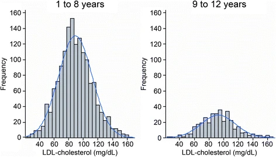

## Preparatory work
Read: OpenIntro Statistics Section 4.1


## The Normal Distribution (bell curve)

:::: {.columns style="display: flex; gap: 50px;"}

::: {.column width="60%"}

```{python}
#| label: fig-bell-curve
#| fig-cap: "A standard normal distribution"
#| fig-alt: "A histogram illustrating the shape of the bell curve. The curve is bell-shaped with a large central prominent mode. It is completely symmetrical. The graph tapers into natural thin tails on the left and the right."

from scipy import stats
import matplotlib.pyplot as plt
import seaborn as sns

# Sample from the standard normal distribution 10000 times using scipy.stats
data_scipy = stats.norm.rvs(size=10000)

# Create a histogram of the data using seaborn
plt.figure(figsize=(8, 6))
sns.histplot(data_scipy, bins=30, edgecolor='black')
plt.title('Histogram of Standard Normal Distribution (10000 samples) - Seaborn')
plt.xlabel('Value')
plt.ylabel('Frequency')
plt.show()
```

:::


::: {.column width="35%"}
### Normal Distribution is:

1. Shaped like a bell
2. Unimodal
3. Symmetric
4. Unskewedx

:::

::::


## The Normal Distribution is everywhere

:::: {.columns style="display: flex; gap: 50px;"}

::: {.column width="50%"}
```{python}
#| label: fig-example-data-normal1
#| fig-cap: "A suspiciously normal data distribution"
#| fig-alt: "A histogram for the variable sat_sum from the file satgpa.csv. The x-axis is labeled sat_sum and ranges from 60 to 140. the y-axis is labeled frequency. The graph is very close in shape to the standard bell curve on the previous slide."
import pandas as pd
import matplotlib.pyplot as plt
import seaborn as sns

file_path = '../openintro.csv/satgpa.csv'
column_name = 'sat_sum'

df1 = pd.read_csv(file_path)
data1 = df1[column_name].dropna()

plt.figure(figsize=(8, 6))
sns.histplot(data1, bins=30, kde=True, edgecolor='black')
plt.title(f'Histogram of {column_name} from {file_path.split("/")[-1]}')
plt.xlabel(column_name)
plt.ylabel('Frequency')
plt.show()
```
:::

::: {.column width="50%"}
```{python}
#| label: fig-example-data-normal2
#| fig-cap: "A suspiciously normal data distribution"
#| fig-alt: "A histogram for the variable some_college_2016 from the file county_complete.csv. The x-axis is labeled some_college_2016 and ranges from 10 to 45. the y-axis is labeled frequency. Once again the graph is very close in shape to the standard bell curve on the previous slide."
import pandas as pd
import matplotlib.pyplot as plt
import seaborn as sns

# Data for the first nearly normal variable
file_path = '../openintro.csv/county_complete.csv'
column_name = 'some_college_2016'

df1 = pd.read_csv(file_path)
data1 = df1[column_name].dropna()

plt.figure(figsize=(8, 6))
sns.histplot(data1, bins=30, kde=True, edgecolor='black')
plt.title(f'Histogram of {column_name} from {file_path.split("/")[-1]}')
plt.xlabel(column_name)
plt.ylabel('Frequency')
plt.show()
```
:::

::::

## Plenty of data distributions are not normal

:::: {.columns style="display: flex; gap: 50px;"}

::: {.column width="50%"}
```{python}
#| label: fig-example-data-not-normal1
#| fig-cap: "A far-from-normal data distribution"
#| fig-alt: "A histogram for the variable age from the file acs12.csv. The x-axis is labeled age and ranges from 0 to about 90. The y-axis is labeled frequency. The graph is largely flat for most of its range, declining for x-values greater than 70. It looks nothing like the bell curve. "
import pandas as pd
import matplotlib.pyplot as plt
import seaborn as sns

file_path = '../openintro.csv/acs12.csv'
column_name = 'age'

df1 = pd.read_csv(file_path)
data1 = df1[column_name].dropna()

plt.figure(figsize=(8, 6))
sns.histplot(data1, bins=30, kde=True, edgecolor='black')
plt.title(f'Histogram of {column_name} from {file_path.split("/")[-1]}')
plt.xlabel(column_name)
plt.ylabel('Frequency')
plt.show()
```
:::

::: {.column width="50%"}
```{python}
#| label: fig-example-data-not-normal2
#| fig-cap: "A suspiciously normal data distribution"
#| fig-alt: "A histogram for the variable income from the file acs12.csv. The x-axis is labeled income and ranges from 0 to about four hundred thousand. The y-axis is labeled frequency. The graph is completely asymmetrical, with a huge spike near x=0 and a long right tail, looking nothing like the bell curve. "
import pandas as pd
import matplotlib.pyplot as plt
import seaborn as sns

file_path = '../openintro.csv/acs12.csv'
column_name = 'income'

df1 = pd.read_csv(file_path)
data1 = df1[column_name].dropna()

plt.figure(figsize=(8, 6))
sns.histplot(data1, bins=30, kde=True, edgecolor='black')
plt.title(f'Histogram of {column_name} from {file_path.split("/")[-1]}')
plt.xlabel(column_name)
plt.ylabel('Frequency')
plt.show()
```
:::

::::


## The Family of Normal Distributions {.activity}

```{ojs}
//| echo: false

// 1. Define Sliders with explicit labelWidth to prevent linebreaks
viewof mu = Inputs.range([-5, 5], {
  value: 0, 
  step: 0.1, 
  label: "μ:", 
})

viewof sigma = Inputs.range([0.1, 3], {
  value: 1, 
  step: 0.1, 
  label: "σ:", 
})

// 2. Dynamic Notation Display
// This updates instantly whenever the sliders move
md`### Distribution: N(${mu.toFixed(1)}, ${(sigma**2).toFixed(2)})`

// 3. The Plot
Plot.plot({
  height: 400,
  grid: true,
  y: { domain: [0, 1], label: "Density" },
  x: { domain: [-10, 10], label: "Value" },
  marks: [
    // The Normal Curve
    Plot.lineY(d3.range(-10, 10, 0.05), {
      x: x => x,
      y: x => (1 / (sigma * Math.sqrt(2 * Math.PI))) * Math.exp(-0.5 * Math.pow((x - mu) / sigma, 2)),
      stroke: "#2c3e50",
      strokeWidth: 3
    }),
    // A dashed vertical line at the mean to help visualize shift
    Plot.ruleX([mu], {stroke: "red", strokeDasharray: "4,4", opacity: 0.5})
  ]
})
```

The notation $N(\mu, \sigma^2)$ refers to a normal distribution while 
telling its mean $\mu$ and its standard deviation $\sigma$. What kind of normal 
distribution is $N(100,16)$?

## Reading the bell curve {.activity}

:::: {.columns style="display: flex; gap: 50px;"}

::: {.column width="50%"}



Cholesterol Level Histograms. 
<small>Source: Slhessarenko, N., Jacob, C.M., Azevedo, R.S. et al. Serum lipids in Brazilian children and adolescents: determining their reference intervals. BMC Public Health 15, 18 (2015). https://doi.org/10.1186/s12889-015-1359-4. Open access article.</small>
:::

::: {.column width="50%"} 
1. What is a typical cholesterol for a six year old?
2. What portion of kids age 1-8 have cholesterol between 60 and 120?
3. How unusual is a cholesterol of 160, for a kid aged 1-8?
4. Do kids age 1-8 have more, less, or about the same cholesterol, compared to kids 9-12?
:::

::::

## Technical definition, for the record
Technically, normal is not just unimodal, symmetric, unskewed, and bell shaped. A normal distribution fits the specific formula below. Lucky for us, we don’t need to use or memorize the formula in Math 125!

$$f(x) = \frac{1}{\sqrt{2\pi\sigma^2}} e^{-\frac{(x - \mu)^2}{2\sigma^2}}$$

## Central Limit Theorem
### When should we *expect* a distribution to be normal?

If a data variable aggregates many small independent effects, 
it’s usually normal or close. For example: 

* Human height (arguably)
* Exam scores (usually)
* Cholesterol levels (usually)
* Game scores in sports (basketball more than hockey!)
* Sampling distributions (This is foreshadowing. More on this later!)

This phenomenon is called the Central Limit Theorem. Its precise statement 
is too technical for Math 125.

## Which are probably normal (or close)? {.activity}

1. The widths of 2x4 lumber at Lowes.
2. The amount of liquid in coffee beverages served at Tim Hortons.
3. The weights of pets in Potsdam.
4. SAT scores of Potsdam High School graduates.
5. The lengths of days (throughout the year) in Potsdam.
6. The results of overlapping political polls, all taken at the same time and place (but polling different people).

## The empirical rule (68-95-99.7)

1. Within one standard deviation from the mean lies 68% of the data.
2. Within two standard deviations from the mean lies 95% of the data.
3. Within three standard deviations from the mean lies 99.7% of the data.

:::: {.columns}

::: {.column width="40%"}
```{python}
#| label: fig-ttw
#| fig-cap: "Time-to-work distribution"
#| fig-alt: "A histogram for the variable time_to_work from the file acs12.csv. The x-axis is labeled commute time and ranges from 0 to 150. The y-axis is labeled frequency. The graph is notably asymmetrical and not bell curve shaped. "
import pandas as pd
import matplotlib.pyplot as plt
import seaborn as sns

file_path = '../openintro.csv/acs12.csv'
column_name = 'time_to_work'

df1 = pd.read_csv(file_path)
data1 = df1[column_name].dropna()

plt.figure(figsize=(6, 6))
sns.histplot(data1, bins=30, kde=True, edgecolor='black')
plt.title(f'Histogram of {column_name} from {file_path.split("/")[-1]}')
plt.xlabel('Commute time (minutes)')
plt.ylabel('Frequency')
plt.show()
```
:::

::: {.column width="60%"}
```{python}
import pandas as pd
import matplotlib.pyplot as plt
import seaborn as sns

file_path = '../openintro.csv/acs12.csv'
column_name = 'time_to_work'

df1 = pd.read_csv(file_path)
df1[column_name].describe()
```

In range $(26 - 2*22.3, 25+2*22.3)$: 96% of data points.
:::

::::

## The empirical rule (68-95-99.7)

(Graphic used with permission, Wikimedia Foundation)

Percentiles and tail areas
A distribution is N(100,102). How much data should be expected above 120?
A distribution is N(60, 22). How much data should be expected below 54?
A distribution is N(10, 52). How much data should be expected above 16?
Use the empirical rule or choose a cdf calculation tool:
Matt Bognar’s CDF calculator
Use Jupyter
from scipy import stats
stats.norm.cdf(2)
Use a Z-table (this is the old school method).

Z-score Intro: So, is that a lot then?
A certain pet parrot’s body temperature is 107°. 
What more would you need to know, before judging whether the body temperature is a health concern?

So, is that a lot then?
A certain pet parrot’s body temperature is 107°. 
The average body temperature for the species is 105°. 
Of course, the parrot is 2° warmer than average. 
What other general stats about parrots and their temperatures would be useful to contextualize this information?

So, is that a lot then?
A certain pet parrot’s body temperature is 107°. 
The average body temperature for the species is 105°. 
Of course, the parrot is 2° warmer than average. 
The standard deviation of body temp is 1.4°. 
Is the bird’s temperature normal, somewhat high, or very high? Why?

Judging relative to the distribution
Judging a data value x relative to the distribution it’s in requires both:
Comparison to the mean of the distribution: subtract μ
Conversion to units of standard deviations: divide by σ
Thus the formula: 
	Z-score = (data value - μ) / σ
The Z-score acts like a interchangeable standard of unusualness, scaled to the distribution the data belongs to.

Z-score = (value - μ) / σ
It counts the number of standard deviations from the mean, which is a statistically “fair” across different distributions.
Z = 0: Average.
Z = +1, -1: Uninteresting.
Z = +2, -2: Raise eyebrow.
Z = +3, -3: Remarkable.
Z = +5, -5: Stunning.
Interpreting the Z-score

Z score
A distribution for test scores is normally distributed N(500, 502). You score 625. Well done! What is your Z score?
An LED manufacture process produces units with illumination N(50,0.22). One particular bulb has illumination 49.4. 
What is its Z-score?
If we reject any bulb at 49.4 or below, how much of the inventory would we waste? 
By reconfiguring the assembly process, we can make the distribution N(51, 12). How would you describe the effect of this change?

The rarity of a Z-score:  the p-value
A good measure of the unusualness of a Z-score is the portion of the curve at least as extreme as that score.
Use Bognar’s tool to answer:
How much of the normal distribution is above Z = 2.3? 
How much of the normal distribution is more extreme, on either side, than Z=3.1?
Use stats.norm.cdf to answer: 
How much of the normal distribution is below  Z = -5?
How much of the normal distribution is above Z = 2.5?

Methods for finding p-value, recap
To find tail areas, you can…
Use the Empirical Rule with some geometric reasoning. (Z=1, 2, 3 only)
Matt Bognar’s CDF calculator (Z in the range -4..4)
Use Jupyter (Any Z will do)
from scipy import stats
stats.norm.cdf(2)
Use a Z-table. (Paper method, limited accuracy and range)

Putting it all together
Most people tend to score about 550 on a given exam, with a standard deviation of 60. Your score is 685. Good job! What is your Z-score? What is your percentile?
An average business day sees about $1000 in sales, with a standard deviation of about $200. Sales were slow today. Only $450. What is the Z-score? How rare is such a disastrous sales day?
A 1000-letter sample of English language should have on average about 80 “a”’s, with a standard deviation of about 9. A randomly chosen Youtube video description has 1000 characters but 120 “a”’s. What is the Z-score of this result? How rare is it? Can you think of alternate explanations?

Homework
Solve homework problems “18-19. The Normal Distribution”
